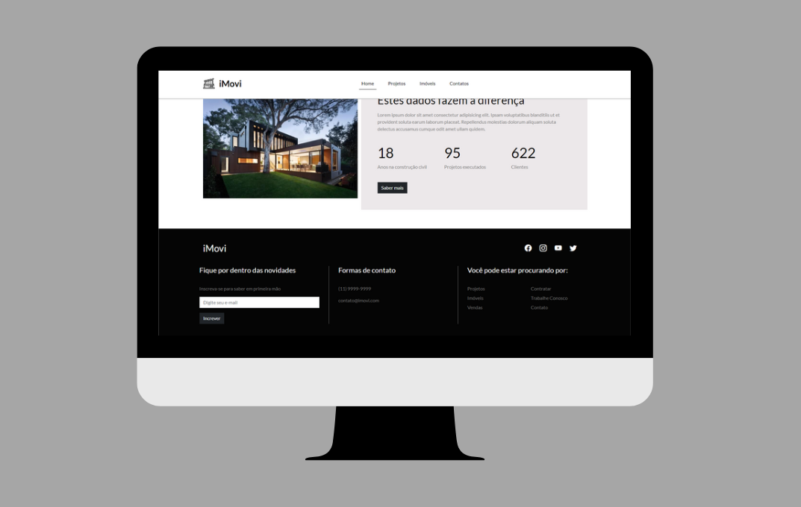

## 🚨 About the project

This project presents a website for a fictitious company to put Bootstrap features into practice. It was developed using HTML, CSS, and Bootstrap, with a Mobile First architecture to be responsive on both mobile and desktop devices.

## 🔨 Tools

&nbsp;
&nbsp;
&nbsp;

## Getting Started

Clone this repository. To run you need node and npm globally on your machine.

```bash
# Clone the project
$ git clone https://github.com/DiogoRPG/rest-countries-react.git
```
